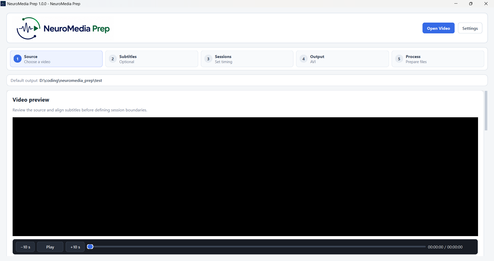
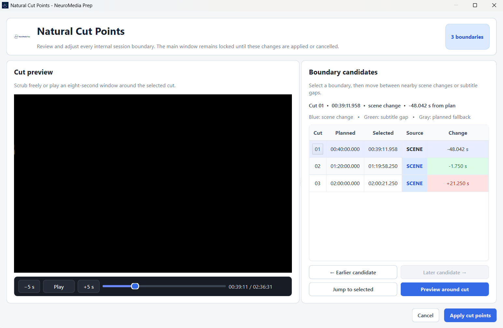
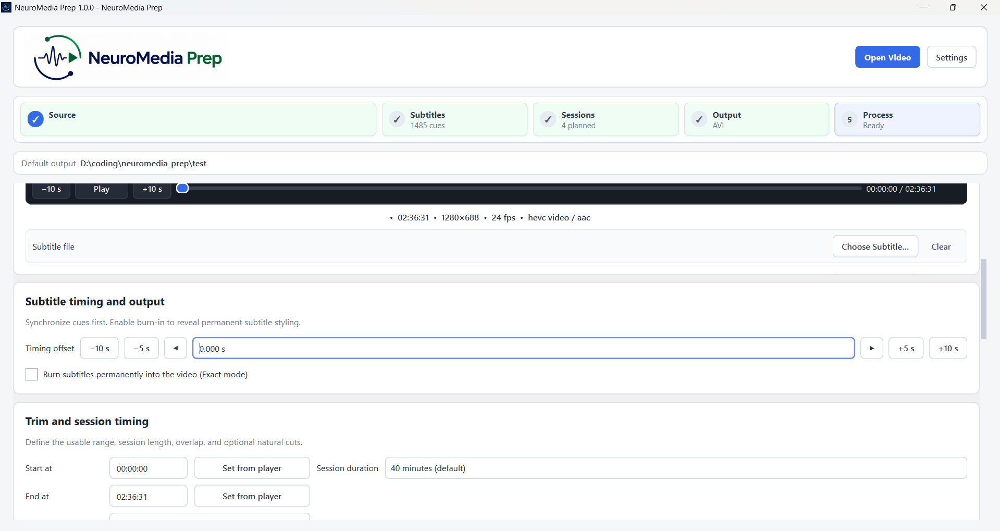
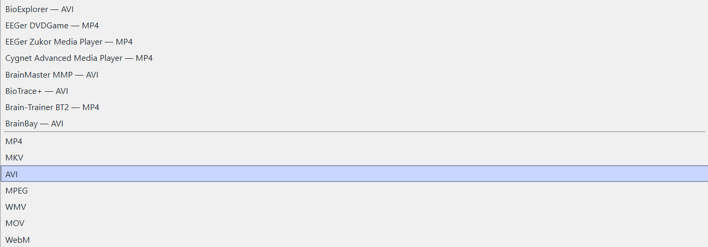

# NeuroMedia Prep

**English** | [فارسی](README.fa.md)

> Open-source Windows video splitter, converter, subtitle processor, and media-preparation utility for neurofeedback, biofeedback, EEG research, training, education, and other structured audiovisual workflows.

NeuroMedia Prep turns long local videos into consistent, session-ready files. It combines a graphical interface with FFmpeg and FFprobe to split and convert videos, adjust or burn subtitles, review natural cut points, apply device-oriented output profiles, and validate completed files.

It was created for neurofeedback workflows, but its core functions are also useful whenever long videos must be divided into repeatable sessions or converted into controlled output formats.

## Features

- Split long videos into fixed or custom-length sessions
- Trim unwanted material from the beginning or end
- Add no overlap, a custom overlap, or automatically calculated equal-length overlap
- Review scene changes and subtitle gaps in the **Natural Cut Points** workspace
- Load, preview, synchronize, split, export, or permanently burn subtitles
- Support subtitle files in multiple languages, including English, Persian, Arabic, and other Unicode text.
- Adjust subtitle font, size, placement, text colour, and outline colour
- Choose between fast stream-copy cutting and exact re-encoding
- Export AVI, MP4, MKV, MOV, MPEG, WebM, and WMV
- Use built-in device profiles, general format profiles, or custom profiles
- Check system readiness before processing
- Validate every completed output with FFprobe
- Save each job in a separate timestamped folder with a JSON manifest
- Process all media locally without uploading video or subtitle content

## Screenshots

### Main interface



### Natural Cut Points workspace



### Subtitle management



### Device profiles



## Installation

### Windows release

1. Open the repository's **Releases** page.
2. Download the latest Windows ZIP package.
3. Extract the entire ZIP file to a normal folder.
4. Run `NeuroMedia Prep.exe`.
5. Complete the first-run system check.

Do not run the application directly from inside the ZIP archive.

### System requirements

- Windows 10 or Windows 11
- At least 10 GB of free disk space is recommended for typical video-processing tasks. Large projects may require additional space depending on source duration and output settings.
- A writable output folder
- FFmpeg and FFprobe included with the release or configured manually

Windows 10 and Windows 11 have been tested. Windows 7 is not officially supported.

### Run from source

Install PySide6:

```bash
python -m pip install PySide6
```

Place `ffmpeg.exe` and `ffprobe.exe` in one of these locations:

- beside the application script,
- inside a `bin` folder,
- on the system `PATH`, or
- at paths selected through **Settings**.

Run:

```bash
python src/neuromedia_prep.py
```

## Basic workflow

1. Open a local video.
2. Optionally load an `.srt` or `.vtt` subtitle file.
3. Set the usable start and end times.
4. Choose session duration and overlap.
5. Optionally enable and review natural cut points.
6. Select a device profile or general output format.
7. Choose **Fast** or **Exact** mode.
8. Review the readiness check.
9. Select **Prepare Video**.
10. Open the timestamped output folder when processing finishes.

## Input support

NeuroMedia Prep is not limited to MP4 input.

The file picker accepts all file types, and FFprobe determines whether the selected file contains a readable video stream. In practice, the application can use any video container and codec supported by the active FFmpeg build.

Common examples include:

- MP4 and M4V
- MKV
- AVI
- MOV
- WMV
- WebM
- MPEG and MPG
- FLV
- TS, MTS, and M2TS
- VOB
- 3GP
- MXF

Actual compatibility depends on the FFmpeg build included with or selected in the application.

## Built-in output formats

| Format | Video encoder | Audio encoder | Maximum resolution |
|---|---|---|---|
| MP4 | H.264 (`libx264`) | AAC | 1920×1080 |
| MKV | H.264 (`libx264`) | AAC | 1920×1080 |
| AVI | MPEG-4 Part 2 (`mpeg4`) | MP3 (`libmp3lame`) | 1280×720 |
| MPEG | MPEG-2 (`mpeg2video`) | MP2 | 720×576 |
| WMV | WMV2 | WMA2 | 1280×720 |
| MOV | H.264 (`libx264`) | AAC | 1920×1080 |
| WebM | VP9 (`libvpx-vp9`) | Opus | 1920×1080 |

The built-in AVI output has been successfully tested on neurofeedback hardware.

## Device-oriented profiles

The current built-in list includes:

| Target profile | Output |
|---|---|
| BioExplorer | AVI, MPEG-4 Part 2, MP3, up to 1280×720 |
| EEGer DVDGame | MP4, H.264, AAC, up to 1920×1080 |
| EEGer Zukor Media Player | MP4, H.264, AAC, up to 1920×1080 |
| Cygnet Advanced Media Player | MP4, H.264, AAC, up to 1920×1080 |
| BrainMaster MMP | AVI, MPEG-4 Part 2, MP3, up to 1280×720 |
| BioTrace+ | AVI, MPEG-4 Part 2, MP3, up to 1280×720 |
| Brain-Trainer BT2 | MP4, H.264, AAC, up to 1920×1080 |
| BrainBay | AVI, MPEG-4 Part 2, MP3, up to 1280×720 |

These are practical compatibility presets based on documented media support and conservative codec choices. They are not manufacturer certification. Compatibility may vary by software version, installed codecs, operating-system configuration, or device setup.

For critical use, test a short output on the target system before processing a full movie.

## Cutting modes

### Fast — stream copy

- Avoids re-encoding
- Usually completes much faster
- Does not introduce re-encoding quality loss
- Requires the source codecs and technical properties to match the selected profile
- Cut positions may move to nearby keyframes
- Cannot permanently burn subtitles

### Exact — re-encode (recommended)

- Produces precise cut positions
- Converts codecs, resolution, pixel format, and audio channels when required
- Supports permanent subtitle burn-in
- Takes longer and uses more processing resources

## Natural Cut Points

When enabled, NeuroMedia Prep searches around each planned session boundary for:

- nearby scene changes,
- subtitle-free gaps, and
- the original planned cut as a fallback.

The modal review workspace allows each boundary to be previewed and adjusted before processing begins.

Automated scene detection is an aid, not a substitute for review.

## Subtitle support

NeuroMedia Prep can:

- read SRT and WebVTT files,
- detect several common text encodings,
- preview subtitle timing,
- shift cues earlier or later,
- split subtitles for each output session,
- export matching UTF-8 SRT files, or
- burn subtitles permanently into Exact-mode outputs.

For Persian, Arabic, and other right-to-left scripts, select a font containing all required characters.

## First-run system check

On first launch, NeuroMedia Prep checks the local installation before opening the main workspace. The check covers:

- Windows compatibility
- FFmpeg and FFprobe availability
- FFmpeg input-format and video-decoder support
- required output encoders
- output-folder write access
- 10 GB of free disk space
- subtitle and Unicode burn-in capability
- consistency of built-in output profiles
- persistent application settings

Critical failures must be resolved before the application continues.

## Privacy

All processing is performed locally. NeuroMedia Prep does not upload videos, subtitles, or job information to an external service.

## Known limitations

- Device compatibility can vary across software and hardware versions.
- Fast mode cannot change codecs, resolution, pixel format, or audio-channel count.
- Natural scene detection requires user review.
- Subtitle rendering depends on the chosen font and FFmpeg/libass support.
- HDR sources are not automatically tone-mapped.
- Output-size estimates are approximate.
- Windows 7 is not officially supported.
- NeuroMedia Prep is a media-preparation utility, not diagnostic or treatment software.

## License

NeuroMedia Prep source code is released under the [MIT License](LICENSE).

FFmpeg is a separate project distributed under its own licensing terms. Windows release packages should retain the licence notices applicable to the bundled FFmpeg build.

## Author

Developed by [S. Mahan Mohajerani](https://github.com/MahanMohajerani).

